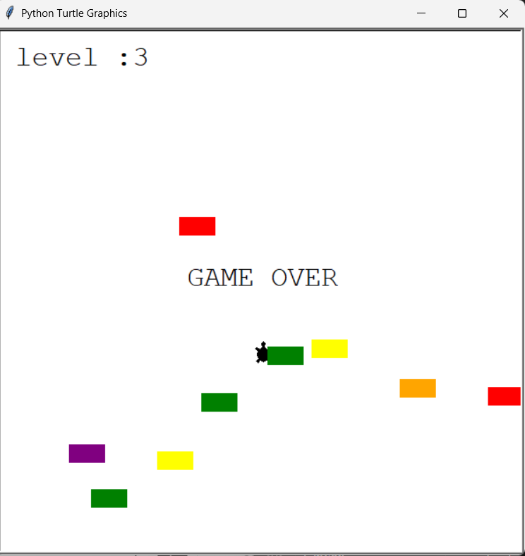

# 🐢 Turtle Crossing Game

A simple arcade-style Turtle Crossing Game built using Python’s built-in `turtle` module.  
The objective of the game is to help the turtle cross the road while avoiding moving cars. Each time the turtle successfully reaches the top, the level increases and the cars move faster.

---

## 🎮 Game Objective

- Control the turtle and help it cross the road.
- Avoid getting hit by moving cars.
- Each successful crossing increases the level.
- The game ends when the turtle collides with a car.

---

## 🛠️ Technologies Used

- Python 3
- Turtle Graphics (`turtle` module)
- Object-Oriented Programming (OOP)

---

## 📂 Project Structure

turtle-crossing-game/
│
├── main.py          # Main game logic  
├── player.py        # Controls turtle movement  
├── car_manager.py   # Generates and manages cars  
├── scoreboard.py    # Displays level and game over  
└── README.md  

---

## 🧠 Concepts Implemented

- Object-Oriented Programming (Classes & Objects)
- Collision Detection
- Game Loop
- Random car generation
- Increasing difficulty (speed increment)
- Event listeners (keyboard controls)

---

## 🎯 Controls

| Key | Action |
|-----|--------|
| ↑   | Move Turtle Forward |

---

## 🚀 How to Run the Game

1. Make sure Python is installed on your system.
2. Clone the repository:

git clone https://github.com/your-username/turtle-crossing-game.git

3. Navigate to the project folder:

cd turtle-crossing-game

4. Run the game:

python main.py

---

## 📸 Game Preview

(Add a screenshot of your game here)

---

## 🔥 Features

- Smooth turtle movement
- Random car colors
- Increasing difficulty levels
- Clean and modular code structure
- Beginner-friendly project

---

## 📚 What I Learned

- Structuring a Python project using multiple files
- Applying OOP concepts in a real project
- Handling collisions in graphical games
- Managing game states and levels

---

## 🏁 Future Improvements

- Add left and right movement
- Add sound effects
- Add high score tracking
- Add restart option after game over

---

🚀
